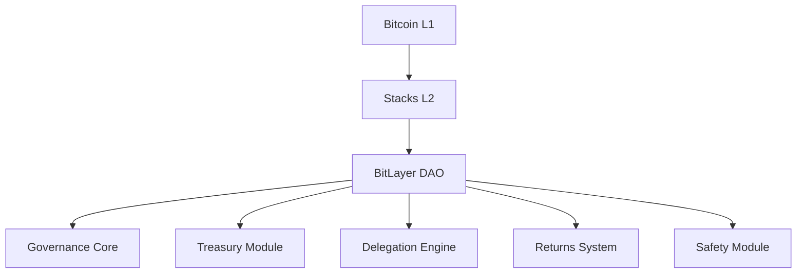

# BitLayer DAO - Decentralized Governance Protocol


Enterprise-grade DAO protocol enabling Bitcoin-native decentralized governance with advanced delegation, treasury management, and profit distribution mechanisms powered by Stacks L2.

## Table of Contents

- [BitLayer DAO - Decentralized Governance Protocol](#bitlayer-dao---decentralized-governance-protocol)
  - [Table of Contents](#table-of-contents)
  - [Overview](#overview)
  - [Key Features](#key-features)
    - [Governance Core](#governance-core)
    - [Treasury Management](#treasury-management)
    - [Delegation Engine](#delegation-engine)
    - [Safety Module](#safety-module)
  - [System Architecture](#system-architecture)
  - [Contract Specifications](#contract-specifications)
    - [Data Structures](#data-structures)
      - [Members](#members)
      - [Proposals](#proposals)
    - [Error Codes](#error-codes)
  - [Core Functions](#core-functions)
    - [Proposal Management](#proposal-management)
      - [Create Proposal](#create-proposal)
      - [Execute Proposal](#execute-proposal)
    - [Voting System](#voting-system)
      - [Cast Vote](#cast-vote)
      - [Delegate Votes](#delegate-votes)
    - [Treasury Management](#treasury-management-1)
      - [Deposit Funds](#deposit-funds)
      - [Withdraw Returns](#withdraw-returns)
  - [Governance Parameters](#governance-parameters)
  - [Installation \& Usage](#installation--usage)
    - [Requirements](#requirements)
  - [Security Considerations](#security-considerations)

## Overview

BitLayer DAO implements a sophisticated governance system combining Bitcoin's security with Stacks L2 scalability. The protocol enables:

- Secure multi-sig proposal system with time-locked executions
- Dynamic voting power delegation mechanisms
- Institutional-grade treasury management
- Profit distribution with vesting schedules
- Emergency governance safeguards
- On-chain investment tracking and ROI distribution

Built using Clarity VM for transparent, predictable execution directly anchored to Bitcoin.

## Key Features

### Governance Core

- Quadratic voting system with vote delegation
- Time-delayed proposal execution
- Configurable quorum thresholds
- Super-majority requirements for critical decisions

### Treasury Management

- Multi-sig fund controls
- Expenditure tracking with STX transparency
- Budget ceilings per proposal type
- Automated ROI distribution pools

### Delegation Engine

- Transferable voting power with expiry
- Cool-down periods for delegation changes
- Delegation history tracking
- Slashing conditions for malicious actors

### Safety Module

- Emergency pause functionality
- Admin override capabilities
- Governance parameter freezing
- Suspicious activity detection

## System Architecture



## Contract Specifications

### Data Structures

#### Members

```clarity
{
    voting-power: uint,
    joined-block: uint,
    total-contributed: uint,
    last-withdrawal: uint
}
```

#### Proposals

```clarity
{
    id: uint,
    proposer: principal,
    title: (string-ascii 100),
    description: (string-utf8 1000),
    amount: uint,
    target: principal,
    start-block: uint,
    end-block: uint,
    yes-votes: uint,
    no-votes: uint,
    status: (string-ascii 20),
    executed: bool
}
```

### Error Codes

| Code | Constant                | Description                          |
| ---- | ----------------------- | ------------------------------------ |
| 100  | ERR-NOT-AUTHORIZED      | Unauthorized access attempt          |
| 101  | ERR-ALREADY-VOTED       | Duplicate voting attempt             |
| 102  | ERR-PROPOSAL-EXPIRED    | Interaction with expired proposal    |
| 103  | ERR-INSUFFICIENT-FUNDS  | Insufficient treasury funds          |
| 104  | ERR-INVALID-AMOUNT      | Invalid STX amount specified         |
| 105  | ERR-PROPOSAL-NOT-ACTIVE | Proposal not in active state         |
| 106  | ERR-QUORUM-NOT-REACHED  | Minimum participation threshold fail |
| 110  | ERR-NO-DELEGATE         | Missing delegation configuration     |
| 111  | ERR-INVALID-DELEGATE    | Invalid delegation attempt           |
| 112  | ERR-EMERGENCY-ACTIVE    | Operation blocked by emergency state |
| 113  | ERR-NOT-EMERGENCY       | Emergency operation in normal state  |
| 114  | ERR-INVALID-PARAMETER   | Invalid governance parameter         |
| 115  | ERR-NO-RETURNS          | No available returns for claim       |

## Core Functions

### Proposal Management

#### Create Proposal

```clarity
(create-proposal
    "(string-ascii 100)"
    "(string-utf8 1000)"
    uint
    principal)
```

- Requires 0.1 STX proposal fee
- Minimum 1 STX proposal amount
- 24-hour voting period

#### Execute Proposal

```clarity
(execute-proposal uint)
```

- Requires quorum (50%+1) participation
- Needs super-majority (66.7%) approval
- 12-hour timelock before execution

### Voting System

#### Cast Vote

```clarity
(vote uint bool uint)
```

- Quadratic voting weights
- Delegated voting power integration
- Vote weight decay over time

#### Delegate Votes

```clarity
(delegate-votes principal uint uint)
```

- Time-limited delegations
- Cool-down period for revocation
- Partial delegation support

### Treasury Management

#### Deposit Funds

```clarity
(deposit uint)
```

- STX-only deposits
- Minimum 1 STX contribution
- Updates member voting power

#### Withdraw Returns

```clarity
(claim-returns uint)
```

- Linear vesting schedules
- Claimable returns tracking
- Anti-drainage protections

## Governance Parameters

Configurable through DAO votes:

```clarity
{
    proposal-fee: u100000,       ;; 0.1 STX
    min-proposal-amount: u1000000, ;; 1 STX
    max-proposal-amount: u1000000000, ;; 1000 STX
    voting-delay: u100,          ;; ~4 hours
    voting-period: u144,         ;; ~24 hours
    timelock-period: u72,        ;; ~12 hours
    quorum-threshold: u500,      ;; 50%
    super-majority: u667         ;; 66.7%
}
```

## Installation & Usage

### Requirements

- Stacks L2 node v3.0+
- Clarinet SDK v1.5+
- Bitcoin testnet environment

## Security Considerations

1. **Multi-Sig Safeguards**

   - 3/5 emergency admin consensus required
   - 48-hour delay on critical parameter changes

2. **Circuit Breakers**

   - Automatic fund freeze on suspicious activity
   - Proposal blacklisting capabilities

3. **Audit Protections**
   - Time-locked code upgrades
   - Immutable core governance logic
